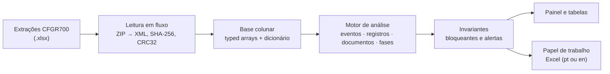

<div align="center">


# AuditAnalyzer

**Análise do log de auditoria CFGR700 do TOTVS Protheus (tabela CT2), 100% no navegador.**

Lê as extrações do relatório, reconcilia linha a linha, responde às perguntas de auditoria interna/SOX
e gera um papel de trabalho em Excel pronto para revisão.

[](https://github.com/Carlosdanyell/AuditAnalyzer/actions/workflows/pages.yml)


[**Abrir o aplicativo**](https://carlosdanyell.github.io/AuditAnalyzer/) ·
[Manual do usuário](public/ajuda.html) ·
[Regras de negócio](docs/REGRAS_CFGR700.md) ·
[Histórico de versões](CHANGELOG.md)

</div>

---

> [!IMPORTANT]
> **Nenhum dado sai do computador.** Não há servidor, analytics, CDN nem fontes externas: o aplicativo é um conjunto
> de arquivos estáticos e a política de segurança do navegador (`connect-src 'self'`) bloqueia qualquer envio.
> Os dados do log ficam só na memória da sessão; o IndexedDB guarda apenas a configuração e as justificativas.

## O que a ferramenta responde

| Pergunta de auditoria | Onde aparece |
|---|---|
| Quais lançamentos e documentos foram **excluídos**, **alterados**, **postados** ou estão **desbalanceados** no período? | Painel e Resumo, por origem (manual, automático, misto) |
| A alteração mudou conteúdo ou foi só efetivação/carimbo de usuário? | Critério de corte das alterações |
| O que ocorreu em **pré-lançamento (9)** e o que ocorreu **após a postagem (1)**? | Modo **Segregado** e aba Segregacao |
| Houve alteração, exclusão ou reabertura de lançamento postado? | Exceções da fase Postado (1), em destaque |
| O mesmo usuário incluiu e efetivou o documento? | Segregação de funções, por documento |
| Todo documento excluído ou alterado tem justificativa? | Justificativas, com cobertura por arquivo e período |
| Nada ficou de fora? | Reconciliação de linhas, eventos e 15 invariantes verificados a cada execução |

## Como funciona



Todo o processamento pesado roda em um **Web Worker**; a tela recebe só agregados e páginas de linhas, e continua
responsiva com arquivos de cerca de 1 milhão de linhas.

## Recursos

<table>
<tr>
<td width="50%" valign="top">

**Leitura e integridade**
- SHA-256 de cada arquivo; CRC32 e tamanho de cada parte do ZIP
- Reconciliação: linhas após o cabeçalho − cabeçalhos repetidos − linhas em branco = linhas de detalhe
- Vários arquivos no mesmo escopo, com alerta de sobreposição e dias sem extração

**Painel**
- Períodos por atalho ou datas livres, data de corte da competência
- Cada número abre a tabela com exatamente aquelas linhas
- Modo **Geral** ou **Segregado** por tipo de saldo
- Sinalizações, cobertura das justificativas e movimento diário

</td>
<td width="50%" valign="top">

**Papel de trabalho em Excel**
- Resumo vivo por fórmulas (compatível com o Excel 2016)
- Abas de justificativas editáveis, dados, critérios e rastreabilidade
- Português ou inglês; datas como datas do Excel, valores em reais

**Controle**
- 15 invariantes; falha bloqueante impede a exportação sem confirmação registrada
- Mesma entrada + mesma configuração = mesma saída
- Configuração versionada, com diferenças em relação ao padrão na rastreabilidade

</td>
</tr>
</table>

## Uso

1. Abra o [aplicativo](https://carlosdanyell.github.io/AuditAnalyzer/) no Chrome ou no Edge. Não há instalação.
2. Carregue uma ou mais extrações do CFGR700 (`.xlsx`), em ordem cronológica, e clique em **Analisar**.
3. Confira a **Reconciliação**, navegue pelo **Painel** e registre as **Justificativas**.
4. Clique em **Exportar planilha** e escolha o escopo e o idioma.

O passo a passo completo, com o ciclo mensal recomendado, está no [manual do usuário](public/ajuda.html), também
disponível no botão **Ajuda** do aplicativo.

## Desenvolvimento

Requer Node.js 20.19 ou superior.

```bash
npm ci
npm run dev         # servidor de desenvolvimento
npm run test        # testes com arquivos sintéticos (rodam no CI)
npm run test:e2e    # ponta a ponta no navegador (Playwright, build de produção)
npm run lint
npm run build       # build de produção para o GitHub Pages
```

`npm run test:local` roda os testes com os arquivos reais em `local/`, pasta que **não é versionada**: o repositório
é público e contém apenas dados sintéticos.

| Documento | Conteúdo |
|---|---|
| [`docs/REGRAS_CFGR700.md`](docs/REGRAS_CFGR700.md) | Regras de negócio e invariantes (especificação) |
| [`docs/ARQUITETURA.md`](docs/ARQUITETURA.md) | Leitura em fluxo, armazenamento colunar, motor, exportação |
| [`docs/INTERFACE.md`](docs/INTERFACE.md) | Comportamentos obrigatórios das telas |
| [`docs/MEDICOES.md`](docs/MEDICOES.md) | Tempo e memória medidos |
| [`CLAUDE.md`](CLAUDE.md) | Restrições e convenções para quem contribui |

**Stack:** Vite · React 18 · TypeScript strict · Web Worker · TanStack Virtual · zod · hash-wasm · fflate ·
Vitest · Playwright.

---

<div align="center">
<sub>Desenvolvido por Carlos Danyell</sub>
</div>
